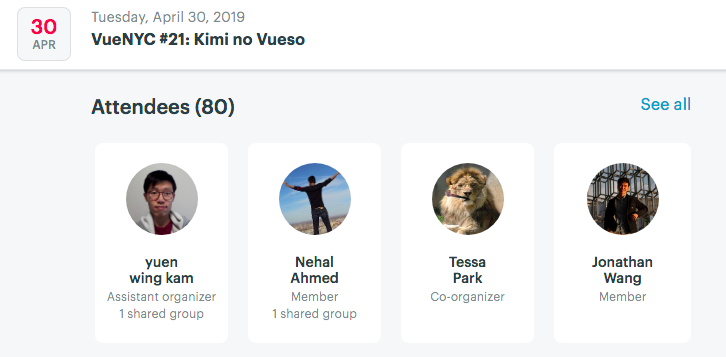

# Vue Meetup #21 : Kimi no Vueso

### [Event Link](https://www.meetup.com/vueJsNYC/events/256168387/)

I attended the 21st meetup for Vue.js "Kimi no Vueso". The meetup was a starkly different representation of the community
that I had previously interacted with on GitHub; while most of the community on GitHub was quite aloof and businesslike,
many of the members of the meetup were developers who used Vue regularly in their jobs and were quite friendly and willing
to strike up conversations with me.

The talk itself was intriguing - the first hour of the meetup was dedicated to community guidelines. It seems that there was 
some violation of the community code of conduct at the last meetup, because very basic guidelines for human interaction, such
as not sexually or racially discriminating against others, came up and were heavily emphasized. The community organizers were
very passionate about creating a space in the community where people did not need to feel like they had to be qualified to
belong, which was the opposite of the online community.

The technical portion of the talk was dedicated to dynamic CSS components and how Vue makes working with them much easier.
The person giving the talk was a software engineer who used Vue to create CSS stylings for her company's website, so it was
great to watch someone with both mastery and use for Vue create a very functional and beautiful app in front of us. Overall,
I enjoyed the meetup a lot and would definitely consider going to more in the future.

